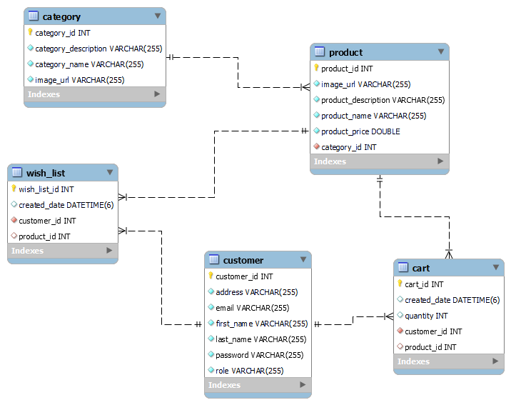

# redesigned-umbrella
<h1>An Ecommerce Project</h1>
  

# Description Of The Project :-
This is an ecommerce backend project in which there are various RESTful APIs. User can perform different type of crud operations.

# Tech stack and Tools used 

- Java
- SpringBoot
- Spring Security with JWT
- MySQL
- GitHub 

<h3>Database Schema:</h3>

# Users of this project are :-
• Admin  
• User  

<h3>Admin Roles are:</h3>

- Admin can register 
- Admin can login into their account
- Admin can create a category
- Admin can view list of category
- Admin can view category by category Id
- Admin can update category by category Id
- Admin can delete category by category Id
- Admin can create product inside a category
- Admin can view list of product
- Admin can view product by product Id
- Admin can update product by product Id
- Admin can delete product by product Id
- Admin can view a user by user Id
- Admin can view the list of user
- Admin can update the his details
- Admin can update his password

<h3>User Roles are:</h3>

- User can register 
- User can login into their account
- User can view list of category
- User can view  product by name
- User can view list of product
- User can add a product to wishlist
- User can see all the product added in the wishlist
- User can delete product from the wishlist
- User can add product to cart
- User can delete product from the cart
- User can update his password
 
 
# Feedback
 
 Valuable feedback will be appreciated. 
 You can reach out to me via below medium.

- [Linkedin](https://www.linkedin.com/feed/)
# Contributor
#### Nishant Kumar
>[GitHub](https://github.com/kumarnishantgunajn5803)
# Thank you for reading 🤗 ! Visit Again......
